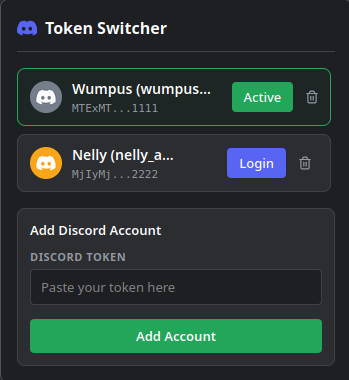

# Discord Token Switcher (Firefox Extension)

A Firefox extension to save multiple Discord authorization tokens locally and switch between accounts with a single click.

*One-shot generated by Gemini 3.5 Flash.*

## Features
- **Auto-Pull User Profiles**: Paste a token, and the extension will automatically query the Discord API to fetch the account's global name, username, and profile picture (avatar).
- **Secure Local Storage**: Tokens are stored strictly in your browser's local storage (`chrome.storage.local`) and are never sent to any third-party server.
- **Easy Account Switching**: Manage multiple accounts at once and switch active sessions with a single click.
- **Premium Discord Aesthetic**: Designed with Discord's dark-mode color scheme, icons, and native-feeling layouts.

## How to Install in Firefox
1. Open Firefox.
2. In the address bar, type `about:debugging` and press **Enter**.
3. Click on **"This Firefox"** on the left menu.
4. Click the **"Load Temporary Add-on..."** button.
5. Navigate to the extension folder where you cloned or saved these files (e.g., `discord-token-login`) and select the `manifest.json` file.
6. The extension is now loaded and will appear in your extensions menu (the puzzle piece icon).

## How to Use
1. Navigate to [discord.com/app](https://discord.com) (or any Discord web page).
2. Open the extension popup from your toolbar.
3. Paste the Discord token in the token input field.
4. Click **"Add Account"**. The extension will pull the account's display name and avatar.
5. Click **"Login"** next to the account you want to use. The page will reload and log you in automatically!

> [!WARNING]
> **Never share your Discord tokens with anyone.** A token gives full access to your account. This extension runs entirely locally in your browser, but you should always be cautious about where you copy and paste your tokens.

